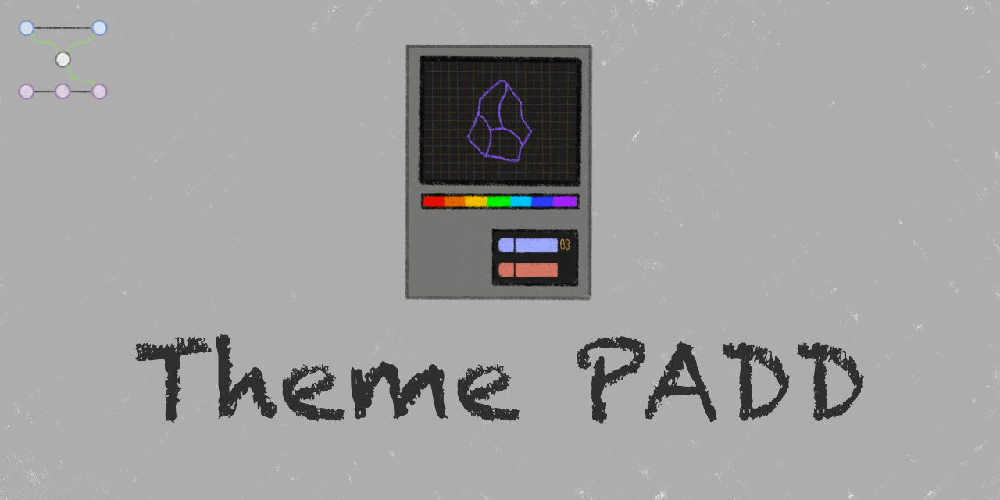

<p align="center">
  
</p>

<p align="center">
  <a href="https://github.com/Jalad25/theme-padd/releases/latest"></a>
	<a href="https://community.obsidian.md/plugins/theme-padd"></a>
</p>
<p align="center">
  <a href="https://community.obsidian.md/plugins/theme-padd"></a>
  <a href="https://github.com/Jalad25/theme-padd/releases"></a>
</p>
<p align="center">
		<a href="https://community.obsidian.md/plugins/theme-padd#scorecard"></a>
	<a href="https://obsidianpluginaudit.com/audit/theme-padd/latest"></a>
</p>

# Theme PADD

A PADD (Palette, Animation, Decoration, and Density) modifier for your themes.

## Features

- **Per-theme settings UI** — Any theme that opts in gets its own page under **Settings → Theme PADD** with the controls its author exposed.
- **Customizations layered on any theme** — Author your own controls for a specific theme. Useful when a theme doesn't ship settings, or doesn't expose the knob you want.
- **Global customizations** — The same mechanism, but applied to the whole vault.
- **Live preview** — Controls apply to the DOM the moment you change them.
- **Auto-discovery** — Theme PADD reads each installed theme's `theme.css` for a `@themepadd` directive and fetches the spec from the theme's GitHub release. No per-theme setup.
- **Version pinning** — Each theme version downloads its own `settings.json`. When a theme updates, the new spec comes with it.
- **Clear error reporting** — If a spec can't be downloaded or is malformed, the settings tab shows a readable error with a **Copy** button.

## Installation

### Obsidian Community Plugins

1. Open Obsidian and go to **Settings → Community plugins**.
2. If restricted mode is on, select **Turn on community plugins**.
3. Select **Browse** and search for **Theme PADD**.
4. Select **Install**, then **Enable**.

### BRAT

[BRAT](https://github.com/TfTHacker/obsidian42-brat) installs plugins directly from their GitHub repository and auto-updates them on each release.

1. Install **BRAT** from **Settings → Community plugins → Browse** and enable it.
2. Open the command palette (`Ctrl+P` on Windows / `Command+P` on macOS) and run **BRAT: Add a beta plugin for testing**.
3. Enter the repository URL: `https://github.com/Jalad25/theme-padd`.
4. Choose whether to track the latest release or the latest commit, then select **Add Plugin**.
5. Open **Settings → Community plugins** and enable **Theme PADD**.

To get future updates, run **BRAT: Check for updates to all beta plugins** from the command palette, or enable auto-update in BRAT's settings.

### Manual

1. Download `main.js`, `manifest.json`, and `styles.css` from the latest release.
2. In your vault, create the folder `.obsidian/plugins/theme-padd/` if it does not already exist.
3. Copy the downloaded files into that folder.
4. Open Obsidian, go to **Settings → Community plugins**, and enable **Theme PADD**.

## Usage

Open **Settings → Theme PADD** (palette icon).

### Themes that support Theme PADD

Installed themes that publish a `settings.json` appear under **Themes**. Click into one to see the controls its author exposed. Changes apply live for active themes.

### Themes that don't support Theme PADD

Themes without a `settings.json` appear in a separate group at the bottom. You can still add your own settings to them.

### Your customizations (per theme)

Every theme, supported or not, has a **Your customizations** entry. This is where *you* author additional controls layered on top of the theme. They apply only while that theme is active.

Click **Add custom settings** to open the JSON editor. The schema you write is the same one theme authors use. See [THEME_AUTHORING.md](THEME_AUTHORING.md) for the full reference. A copy-and-paste example is below.

### Global customizations

At the top of the Theme PADD settings. Same JSON editor, same schema, but applied to the whole vault.

### Cascade

When Theme PADD applies your settings to the vault, layers stack in this order:

1. **Theme author's settings** 
2. **Global customizations**
3. **Your per-theme customizations** 

Later layers override earlier ones when keys collide.

## Customization quick example

Paste this into the **Add custom settings** editor (either per-theme or global) to add a body-font-size slider:

```json
{
  "schemaVersion": 1,
  "settingItems": [
    {
      "type": "control",
      "name": "Body font size",
      "control": {
        "type": "slider",
        "id": "body-font-size",
        "min": 12,
        "max": 24,
        "step": 1,
        "defaultValue": 16,
        "onChange": {
          "action": "set-css-variable",
          "name": "--font-text-size"
        }
      }
    }
  ]
}
```

For the full schema (every control type, every action type, validation rules), see [THEME_AUTHORING.md](THEME_AUTHORING.md).

## Important Notes

### Errors

If a theme says it supports Theme PADD but something goes wrong, Theme PADD shows a clearly labeled error on that theme's entry. There's a **Copy** button for the details, useful if you want to file an issue with the theme author.

### Version pinning

Each theme version's settings come from that release's `settings.json` asset. When a theme author publishes an update, Theme PADD fetches the new spec automatically. If you downgrade a theme to a version that never shipped one, you'll see a fetch error until you re-upgrade.

### Uninstalling a theme

When you remove a theme from Obsidian, Theme PADD cleans up alongside it:

- Any control values you set in that theme's settings.
- Any per-theme customization JSON you wrote for it.

Global customizations are unaffected. If you're about to delete a theme but want to keep your customizations, copy the JSON out of the **Edit customizations** modal first.

## License

GNU Affero General Public License v3.0. See [LICENSE](LICENSE) for details.
